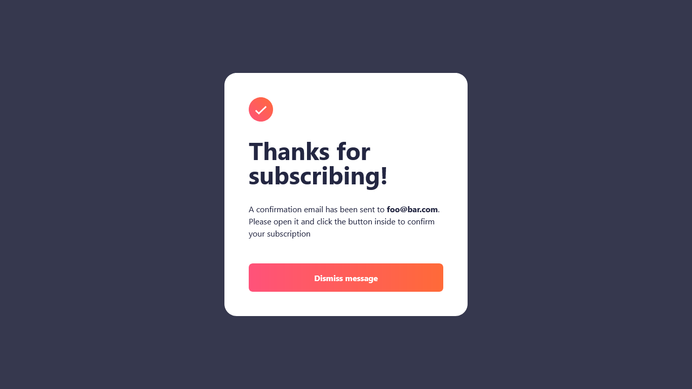

# Frontend Mentor - Newsletter sign-up form with success message solution

This is a solution to the [Newsletter sign-up form with success message challenge on Frontend Mentor](https://www.frontendmentor.io/challenges/newsletter-signup-form-with-success-message-3FC1AZbNrv). Frontend Mentor challenges help you improve your coding skills by building realistic projects. 

## Table of contents

- [Overview](#overview)
  - [The challenge](#the-challenge)
  - [Screenshots](#screenshots)
  - [Links](#links)
- [My process](#my-process)
  - [Built with](#built-with)
  - [What I learned](#what-i-learned)
  - [Continued development](#continued-development)
  - [Useful resources](#useful-resources)
- [Author](#author)

**Note: Delete this note and update the table of contents based on what sections you keep.**

## Overview

### The challenge

Users should be able to:

- Add their email and submit the form
- See a success message with their email after successfully submitting the form
- See form validation messages if:
  - The field is left empty
  - The email address is not formatted correctly
- View the optimal layout for the interface depending on their device's screen size
- See hover and focus states for all interactive elements on the page

### Screenshots




<p>
  
  
</p>

### Links

- Solution URL: [Frontend Mentor](https://www.frontendmentor.io/solutions/responsive-newsletter-sign-up-page-with-react-nextjs-and-tailwind-FvrhBOVdbP)
- Live Site URL: [Vercel](https://newsletter-sign-up-with-success-message-alpha.vercel.app/)

## My process

### Built with

- Semantic HTML5 markup
- CSS custom properties
- Flexbox
- CSS Grid
- Mobile-first workflow
- [React](https://reactjs.org/) - JS library
- [Next.js](https://nextjs.org/) - React framework

### What I learned

Good opportunity to review basic concepts of React and Next, and how to create a project from scratch which I had never done in a while. Apparently Next 13 has an improved new Router with a different pattern, that was fun to find out.

So instead of arranging pages this way

```html
- src
  - components
    - layout.jsx
  - pages
    - index.jsx
    - success.jsx
```

Now we do it like so

```html
- src
  - app
    - page.jsx
    - layout.jsx
    - success
      - page.jsx
```

### Continued development

There is a lot that can be improved on this project, in terms of good practices, and I'd also like to add some functionality to it, maybe sending a make believe email.

### Useful resources

- [Next.js 13: complete guide to Server Components and the App Directory](https://makerkit.dev/blog/tutorials/nextjs13) - Found this article because my project wasn't serving pages correctly since I was using the wrong structure. Great material to update on the newest NextJS version.


## Author

- Website - TBD
- Frontend Mentor - [@marxguimaraes](https://www.frontendmentor.io/profile/marxguimaraes)

